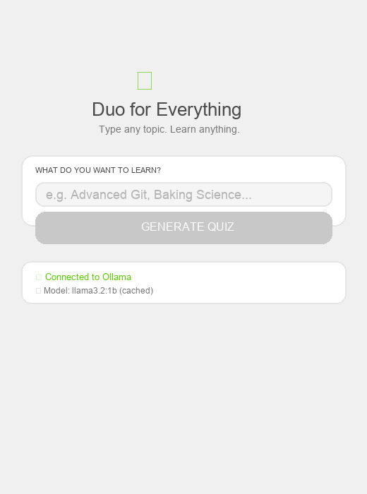

<p align="center">
  
</p>

<h1 align="center">📚 Duo for Everything</h1>

<p align="center">
  <strong>Fully offline, on-device Duolingo for any topic.</strong><br />
  Powered by Vite, React, and Ollama.
</p>

<p align="center">
  
  
  
  
  
  
  
</p>

---

## 🎯 How It Works

1. Type **any topic** you want to learn (e.g., "Advanced Git Commands", "Baking Science", "Ancient Rome")
2. The app sends your topic to a **local AI model** running via **Ollama** on your machine
3. The model generates a 10-question multiple-choice quiz
4. Answer questions, earn XP, build your streak, and level up — **all offline**, no API keys needed

## 🚀 Quick Start

### Prerequisites
- [Ollama](https://ollama.com) installed on your machine

### 1. Start Ollama
```bash
ollama serve
```

### 2. Launch the app
```bash
npm install
npm run dev
```

### 3. Pull the local model
Open `http://localhost:5173` and click **"Setup local model"** to download `llama3.2:1b` (~650MB, one-time).

### 4. Learn anything
Type a topic, hit **"Generate Quiz"**, and start learning!

## ✨ Features

| Feature | Details |
|---------|---------|
| **Topic-Agnostic** | Any subject — science, history, coding, cooking |
| **On-Device AI** | Ollama runs locally. No cloud, no API costs, no data leakage |
| **Hearts System** | Start with 5 hearts, lose 1 per wrong answer, refill screen at 0 |
| **XP & Levels** | +10 XP per correct answer, 100 XP per level, confetti on level up |
| **Daily Streak** | Fire icon tracks consecutive active days |
| **Duolingo UI** | Playful colors, heavy borders, spring animations |

## 🏗 Project Structure

```
src/
  components/
    Dashboard.tsx      # Topic input & model setup
    QuizEngine.tsx     # Quiz UI with questions/answers
    TopBar.tsx         # Streak, hearts, XP bar
    StreakCounter.tsx  # Daily streak fire icon
    HeartsDisplay.tsx  # Lives system
    XPProgressBar.tsx  # XP & level progress
    RefillHearts.tsx   # Hearts refill screen
  lib/
    ollama.ts          # Local AI controller (Ollama API)
  store/
    gameStore.ts       # Zustand state (gamification + persistence)
  types/
    index.ts           # TypeScript type definitions
  App.tsx              # Root component with view routing
```

## 🧠 On-Device AI Architecture

The `ollama.ts` module handles:
- Checking if Ollama is running
- Listing and pulling models
- Sending **structured prompts** that force the local model to output clean JSON
- Parsing the response into the quiz engine's 10-question format

The prompt is carefully engineered with few-shot examples and strict formatting rules so even small models (1B params) produce valid JSON.

## 🎮 Gamification (Persisted via LocalStorage)

| Mechanic | Implementation |
|----------|---------------|
| **Hearts** | 5 max. -1 on wrong. Lock screen at 0. Refill button resets |
| **XP** | +10 per correct. 100 XP thresholds per level |
| **Streak** | Timestamps compared daily. Resets after 1 missed day |
| **Level-Up** | Confetti explosion animation via `react-confetti-explosion` |

## 🛠 Tech Stack

- **Vite 8.1** + **React 19** + **TypeScript 6** — Modern, fast tooling
- **TailwindCSS v4** — Duolingo-inspired design tokens
- **Zustand 5** — Lightweight state management with localStorage persistence
- **Framer Motion** — Spring animations for XP bar, hearts, transitions
- **Ollama** — Local LLM inference engine (supports any model)

## 🔧 Customizing the Model

Edit `src/lib/ollama.ts`:
```typescript
const DEFAULT_MODEL = 'llama3.2:1b'; // Change to any Ollama model
```

Larger models (llama3.1:8b, phi4, mistral) produce better quizzes but run slower.

## 📄 License

MIT — free to use, modify, and distribute.
